# CHC Insight CRM - System Architecture Document

## Executive Summary

CHC Insight is a comprehensive Customer Relationship Management (CRM) application designed for Long-Term Services and Supports (LTSS) business within Managed Care Organization (MCO) environments. The system captures survey/assessment data to meet state requirements while tracking member, provider, and internal performance metrics.

**Version:** 1.0.0  
**Last Updated:** February 2026  
**Classification:** Internal Technical Documentation

---

## 1. System Overview

### 1.1 Purpose and Scope

CHC Insight serves healthcare administrators, care coordinators, compliance officers, quality assurance teams, and executive stakeholders by providing:

- **Dynamic Survey Engine**: Create and manage surveys with conditional logic
- **Hierarchical Form Management**: Categories → Types → Templates → Instances
- **Workflow Management**: Configurable approval workflows with role-based task assignment
- **Role-Based Access Control**: Multi-tenant architecture with granular permissions
- **HIPAA Compliance**: Secure data handling with audit trails and encryption
- **UM Consolidator**: Utilization Management review and appeals workflow
- **Progress Notes**: Clinical documentation with analytics

### 1.2 Technology Stack Summary

| Layer | Technology | Version |
|-------|------------|---------|
| Frontend | Next.js (React) | 15.x (React 19) |
| Backend | Express.js | 4.18+ |
| Database | MS SQL Server | 2022 |
| Cache | Redis | 7.x |
| Language | TypeScript | 5.5+ |
| Container | Docker | Latest |

---

## 2. High-Level Architecture

### 2.1 Architecture Diagram

```
┌─────────────────────────────────────────────────────────────────────────────┐
│                              CLIENT LAYER                                    │
│  ┌─────────────────────────────────────────────────────────────────────┐   │
│  │                    Next.js 15 Frontend (React 19)                    │   │
│  │  ┌──────────┐  ┌──────────┐  ┌──────────┐  ┌──────────────────┐   │   │
│  │  │ App      │  │ shadcn/  │  │ TanStack │  │ React Hook Form  │   │   │
│  │  │ Router   │  │ ui       │  │ Query    │  │ + Zod            │   │   │
│  │  └──────────┘  └──────────┘  └──────────┘  └──────────────────┘   │   │
│  └─────────────────────────────────────────────────────────────────────┘   │
└─────────────────────────────────────────────────────────────────────────────┘
                                      │
                                      │ HTTPS/REST API
                                      ▼
┌─────────────────────────────────────────────────────────────────────────────┐
│                              API LAYER                                       │
│  ┌─────────────────────────────────────────────────────────────────────┐   │
│  │                    Express.js Backend (Node.js)                      │   │
│  │  ┌──────────┐  ┌──────────┐  ┌──────────┐  ┌──────────────────┐   │   │
│  │  │ Routes   │  │ Middle-  │  │ Control- │  │ Services         │   │   │
│  │  │          │  │ ware     │  │ lers     │  │                  │   │   │
│  │  └──────────┘  └──────────┘  └──────────┘  └──────────────────┘   │   │
│  └─────────────────────────────────────────────────────────────────────┘   │
└─────────────────────────────────────────────────────────────────────────────┘
                                      │
                    ┌─────────────────┴─────────────────┐
                    ▼                                   ▼
┌───────────────────────────────┐   ┌───────────────────────────────────────┐
│        DATA LAYER             │   │           CACHE LAYER                  │
│  ┌─────────────────────────┐ │   │  ┌─────────────────────────────────┐  │
│  │   MS SQL Server 2022    │ │   │  │           Redis 7.x             │  │
│  │  ┌───────────────────┐  │ │   │  │  ┌─────────────────────────┐   │  │
│  │  │ UniversalDatabase │  │ │   │  │  │ Session Cache           │   │  │
│  │  │ Service           │  │ │   │  │  │ Query Cache             │   │  │
│  │  └───────────────────┘  │ │   │  │  │ Rate Limiting           │   │  │
│  │  ┌───────────────────┐  │ │   │  │  └─────────────────────────┘   │  │
│  │  │ Knex.js           │  │ │   │  └─────────────────────────────────┘  │
│  │  │ Migrations        │  │ │   └───────────────────────────────────────┘
│  │  └───────────────────┘  │ │
│  └─────────────────────────┘ │
└───────────────────────────────┘
```

### 2.2 Deployment Architecture

```
┌─────────────────────────────────────────────────────────────────────────────┐
│                        SHARED INFRASTRUCTURE                                 │
│  ┌─────────────────────────────┐  ┌─────────────────────────────────────┐  │
│  │   MS SQL Server 2022        │  │           Redis 7.x                  │  │
│  │   ├─ chc_insight_development│  │   ├─ DB 0: Development              │  │
│  │   ├─ chc_insight_staging    │  │   ├─ DB 1: Staging                  │  │
│  │   └─ chc_insight_production │  │   └─ DB 2: Production               │  │
│  └─────────────────────────────┘  └─────────────────────────────────────┘  │
└─────────────────────────────────────────────────────────────────────────────┘
                                      │
        ┌─────────────────────────────┼─────────────────────────────┐
        ▼                             ▼                             ▼
┌───────────────────┐   ┌───────────────────┐   ┌───────────────────────────┐
│   DEVELOPMENT     │   │     STAGING       │   │       PRODUCTION          │
│  ┌─────────────┐  │   │  ┌─────────────┐  │   │  ┌─────────────────────┐  │
│  │ Frontend    │  │   │  │ Frontend    │  │   │  │ Frontend            │  │
│  │ Port: 3000  │  │   │  │ Port: 3010  │  │   │  │ Port: 3020          │  │
│  └─────────────┘  │   │  └─────────────┘  │   │  └─────────────────────┘  │
│  ┌─────────────┐  │   │  ┌─────────────┐  │   │  ┌─────────────────────┐  │
│  │ Backend     │  │   │  │ Backend     │  │   │  │ Backend             │  │
│  │ Port: 3001  │  │   │  │ Port: 3011  │  │   │  │ Port: 3021          │  │
│  └─────────────┘  │   │  └─────────────┘  │   │  └─────────────────────┘  │
└───────────────────┘   └───────────────────┘   └───────────────────────────┘
```

---

## 3. Frontend Architecture

### 3.1 Technology Stack

| Component | Technology | Purpose |
|-----------|------------|---------|
| Framework | Next.js 15 | App Router with React 19 Server Components |
| UI Library | shadcn/ui | Radix UI primitives with Tailwind CSS |
| State Management | TanStack Query v5 | Server state caching and synchronization |
| Form Handling | React Hook Form + Zod | Form state and validation |
| Styling | Tailwind CSS v4 | Utility-first CSS with oklch color system |
| Icons | Lucide React | Consistent icon library |
| Charts | Recharts | Data visualization |

### 3.2 Directory Structure

```
frontend/src/
├── app/                          # Next.js 15 App Router
│   ├── admin/                    # Admin management pages
│   ├── analytics/                # Analytics and reporting
│   ├── dashboard/                # Main dashboard
│   ├── data-management/          # Data import/export
│   ├── form-management/          # Form builder and management
│   ├── members/                  # Member management
│   ├── progress-notes/           # Progress notes management
│   ├── providers/                # Provider management
│   ├── um-consolidator/          # UM consolidation workflow
│   ├── login/                    # Authentication
│   └── layout.tsx                # Root layout with providers
├── components/
│   ├── ui/                       # shadcn/ui components (auto-generated)
│   ├── features/                 # Feature-specific components
│   ├── auth/                     # Authentication components
│   ├── layout/                   # Layout components
│   └── custom/                   # Custom reusable components
├── hooks/                        # Custom React hooks
├── lib/                          # Core utilities
│   ├── api/                      # API client modules
│   ├── utils/                    # Utility functions
│   └── validations/              # Zod validation schemas
├── contexts/                     # React Context providers
├── providers/                    # Provider wrappers
├── styles/                       # Centralized CSS
└── types/                        # TypeScript definitions
```

### 3.3 State Management Architecture

```
┌─────────────────────────────────────────────────────────────────┐
│                    STATE MANAGEMENT LAYERS                       │
├─────────────────────────────────────────────────────────────────┤
│  SERVER STATE (TanStack Query)                                   │
│  ┌─────────────────────────────────────────────────────────┐    │
│  │ • API data caching (5-minute stale time)                │    │
│  │ • Background refetching                                  │    │
│  │ • Optimistic updates with rollback                       │    │
│  │ • Request deduplication                                  │    │
│  │ • Automatic retry (3 retries, exponential backoff)       │    │
│  └─────────────────────────────────────────────────────────┘    │
├─────────────────────────────────────────────────────────────────┤
│  LOCAL UI STATE (React Context)                                  │
│  ┌─────────────────────────────────────────────────────────┐    │
│  │ • AuthContext - User authentication state                │    │
│  │ • ThemeProvider - Dark/light mode                        │    │
│  │ • QueryProvider - TanStack Query client                  │    │
│  └─────────────────────────────────────────────────────────┘    │
├─────────────────────────────────────────────────────────────────┤
│  FORM STATE (React Hook Form)                                    │
│  ┌─────────────────────────────────────────────────────────┐    │
│  │ • Zod schema validation                                  │    │
│  │ • Optimized re-renders                                   │    │
│  │ • Automatic form state management                        │    │
│  └─────────────────────────────────────────────────────────┘    │
└─────────────────────────────────────────────────────────────────┘
```

### 3.4 API Client Architecture

```typescript
// Centralized API Client Pattern
class ApiClient {
  private baseURL: string;
  private defaultHeaders: Record<string, string>;

  async request<T>(endpoint: string, options: RequestInit): Promise<ApiResponse<T>> {
    // Automatic JWT token injection
    // Request/response logging
    // Error handling with detailed logging
  }
}

// API Modules
const authApi = { login, logout, getCurrentUser, refreshToken };
const formHierarchyApi = { getCategories, getTypes, getTemplates, getInstances };
const memberApi = { search, getById, upload };
const providerApi = { search, getById };
const progressNotesApi = { create, update, getAnalytics };
const umConsolidatorApi = { getReviews, updateReview, getAppeals };
```

### 3.5 Authentication Flow

```
┌──────────────┐     ┌──────────────┐     ┌──────────────┐
│   Login      │────▶│   Backend    │────▶│   Database   │
│   Page       │     │   /auth/     │     │   users      │
└──────────────┘     │   login      │     └──────────────┘
       │             └──────────────┘            │
       │                    │                    │
       │                    ▼                    │
       │             ┌──────────────┐            │
       │             │ JWT Tokens   │◀───────────┘
       │             │ (access +    │
       │             │  refresh)    │
       │             └──────────────┘
       │                    │
       ▼                    ▼
┌──────────────┐     ┌──────────────┐
│ localStorage │◀────│ AuthContext  │
│ auth_token   │     │ user state   │
└──────────────┘     └──────────────┘
       │
       ▼
┌──────────────────────────────────────┐
│ Protected Routes                      │
│ ┌──────────────┐  ┌──────────────┐   │
│ │ProtectedRoute│──│  RoleGuard   │   │
│ └──────────────┘  └──────────────┘   │
└──────────────────────────────────────┘
```

---

## 4. Backend Architecture

### 4.1 Technology Stack

| Component | Technology | Purpose |
|-----------|------------|---------|
| Runtime | Node.js 18+ | ES2022 features, LTS support |
| Framework | Express.js 4.18+ | Web framework with async/await |
| Database | MS SQL Server 2022 | Primary database |
| ORM/Query Builder | Knex.js | Migrations and query building |
| Cache | Redis | Session and query caching |
| Authentication | JWT + Passport.js | Token-based auth |
| Validation | Zod | Runtime validation and type inference |
| Security | Helmet.js + bcrypt | Security headers and password hashing |

### 4.2 Directory Structure

```
backend/src/
├── config/                       # Configuration files
│   ├── database.ts               # Database connection setup
│   ├── environment.ts            # Environment configuration
│   ├── knex.ts                   # Knex configuration
│   └── redis.ts                  # Redis configuration
├── controllers/                  # HTTP request handlers
│   ├── auth.controller.ts        # Authentication endpoints
│   ├── form-hierarchy.controller.ts
│   ├── member-data.controller.ts
│   ├── progress-notes.controller.ts
│   └── um-review.controller.ts
├── services/                     # Business logic layer
│   ├── universal-database.service.ts  # Database abstraction
│   ├── auth.service.ts           # Authentication logic
│   ├── form-hierarchy.service.ts
│   └── cache.service.ts          # Redis caching
├── middleware/                   # Express middleware
│   ├── auth.middleware.ts        # JWT validation
│   ├── audit.middleware.ts       # HIPAA audit logging
│   ├── errorHandler.ts           # Global error handling
│   └── security-headers.middleware.ts
├── routes/                       # API route definitions
├── database/
│   ├── migrations/               # Knex migrations
│   └── seeds/                    # Database seeds
├── modules/                      # Feature-specific modules
│   └── {module}/validation/      # Module-specific validation
├── shared/                       # Shared utilities
│   └── validation/               # Base validation schemas
└── types/                        # TypeScript definitions
```

### 4.3 Layered Architecture Pattern

```
┌─────────────────────────────────────────────────────────────────┐
│                      ROUTES LAYER                                │
│  ┌─────────────────────────────────────────────────────────┐    │
│  │ • Route definitions                                      │    │
│  │ • Middleware application                                 │    │
│  │ • Request routing to controllers                         │    │
│  └─────────────────────────────────────────────────────────┘    │
├─────────────────────────────────────────────────────────────────┤
│                    CONTROLLER LAYER                              │
│  ┌─────────────────────────────────────────────────────────┐    │
│  │ • HTTP request/response handling                         │    │
│  │ • Request validation (Zod schemas)                       │    │
│  │ • Authentication context extraction                      │    │
│  │ • Error code to HTTP status mapping                      │    │
│  └─────────────────────────────────────────────────────────┘    │
├─────────────────────────────────────────────────────────────────┤
│                     SERVICE LAYER                                │
│  ┌─────────────────────────────────────────────────────────┐    │
│  │ • Business logic implementation                          │    │
│  │ • Database operations via UniversalDatabaseService       │    │
│  │ • Transaction management                                 │    │
│  │ • Data transformation and formatting                     │    │
│  └─────────────────────────────────────────────────────────┘    │
├─────────────────────────────────────────────────────────────────┤
│                    DATABASE LAYER                                │
│  ┌─────────────────────────────────────────────────────────┐    │
│  │ • UniversalDatabaseService (singleton)                   │    │
│  │ • LocalDB + SQL Server support                           │    │
│  │ • Connection pooling                                     │    │
│  │ • Automatic parameter conversion                         │    │
│  └─────────────────────────────────────────────────────────┘    │
└─────────────────────────────────────────────────────────────────┘
```

### 4.4 UniversalDatabaseService Architecture

```typescript
// Singleton pattern for database access
class UniversalDatabaseService {
  private static instance: UniversalDatabaseService;
  
  // Two query methods:
  
  // rawQuery() - Returns rows directly (for SELECT)
  async rawQuery<T>(sql: string, params?: Record<string, unknown>): Promise<T[]>
  
  // query() - Returns QueryResult with metadata (for INSERT/UPDATE/DELETE)
  async query<T>(sql: string, params?: Record<string, unknown>): Promise<QueryResult<T>>
  
  // CRUD operations
  async select(table: string, columns: string[], where: object): Promise<QueryResult>
  async insert(table: string, data: object): Promise<QueryResult>
  async update(table: string, data: object, where: object): Promise<QueryResult>
  async delete(table: string, where: object): Promise<QueryResult>
  
  // Transaction support
  async transaction<T>(callback: (trxDb) => Promise<T>): Promise<T>
}
```

### 4.5 Middleware Stack

```
Request Flow:
┌──────────────────────────────────────────────────────────────┐
│ 1. helmet() - Security headers (CSP, HSTS, X-Frame-Options)  │
├──────────────────────────────────────────────────────────────┤
│ 2. cors() - CORS configuration with allowed origins          │
├──────────────────────────────────────────────────────────────┤
│ 3. compression() - Response compression                      │
├──────────────────────────────────────────────────────────────┤
│ 4. express.json() - Body parsing (10MB limit)                │
├──────────────────────────────────────────────────────────────┤
│ 5. securityHeadersMiddleware - Custom security headers       │
├──────────────────────────────────────────────────────────────┤
│ 6. rateLimitMiddleware - Rate limiting per environment       │
├──────────────────────────────────────────────────────────────┤
│ 7. requestLoggerMiddleware - Request logging with trace ID   │
├──────────────────────────────────────────────────────────────┤
│ 8. auditMiddleware - HIPAA-compliant audit logging           │
├──────────────────────────────────────────────────────────────┤
│ 9. authMiddleware - JWT validation (protected routes)        │
├──────────────────────────────────────────────────────────────┤
│ 10. Route Handler                                            │
├──────────────────────────────────────────────────────────────┤
│ 11. errorHandler - Global error handling                     │
└──────────────────────────────────────────────────────────────┘
```

---

## 5. Database Architecture

### 5.1 Database Design Principles

- **Multi-Tenant Architecture**: All tables include `tenant_id` for data isolation
- **Hybrid Schema**: Core fields as columns, complex data as JSON (nvarchar(max))
- **Migration-Driven**: All schema changes through Knex migrations
- **Comprehensive Indexing**: Performance-optimized indexes on all query patterns
- **Audit Trail**: `created_by`, `updated_by`, `created_at`, `updated_at` on all tables

### 5.2 Entity Relationship Diagram

```
┌─────────────────────────────────────────────────────────────────────────────┐
│                           CORE ENTITIES                                      │
├─────────────────────────────────────────────────────────────────────────────┤
│                                                                              │
│  ┌──────────────┐         ┌──────────────┐         ┌──────────────┐        │
│  │   tenants    │◀────────│    users     │────────▶│    roles     │        │
│  │              │         │              │         │              │        │
│  │ id           │         │ id           │         │ id           │        │
│  │ name         │         │ tenant_id    │         │ tenant_id    │        │
│  │ subdomain    │         │ email        │         │ name         │        │
│  │ configuration│         │ password_hash│         │ permissions  │        │
│  │ is_active    │         │ first_name   │         │              │        │
│  └──────────────┘         │ last_name    │         └──────────────┘        │
│                           │ is_active    │                │                 │
│                           └──────────────┘                │                 │
│                                  │                        │                 │
│                                  ▼                        ▼                 │
│                           ┌──────────────┐         ┌──────────────┐        │
│                           │  user_roles  │◀────────│              │        │
│                           │              │         │              │        │
│                           │ user_id      │         │              │        │
│                           │ role_id      │         │              │        │
│                           │ assigned_by  │         │              │        │
│                           └──────────────┘         └──────────────┘        │
│                                                                              │
└─────────────────────────────────────────────────────────────────────────────┘

┌─────────────────────────────────────────────────────────────────────────────┐
│                      FORM HIERARCHY (4-Level Structure)                      │
├─────────────────────────────────────────────────────────────────────────────┤
│                                                                              │
│  ┌──────────────────┐                                                       │
│  │ form_categories  │  Level 1: Categories (Cases, Assessments)             │
│  │                  │                                                       │
│  │ id               │                                                       │
│  │ tenant_id        │                                                       │
│  │ name             │                                                       │
│  │ description      │                                                       │
│  └────────┬─────────┘                                                       │
│           │                                                                  │
│           ▼                                                                  │
│  ┌──────────────────┐                                                       │
│  │   form_types     │  Level 2: Types (BH Referrals, Health Risk)           │
│  │                  │                                                       │
│  │ id               │                                                       │
│  │ category_id      │                                                       │
│  │ name             │                                                       │
│  │ business_rules   │  (JSON)                                               │
│  └────────┬─────────┘                                                       │
│           │                                                                  │
│           ▼                                                                  │
│  ┌──────────────────┐                                                       │
│  │ form_templates   │  Level 3: Templates (versioned)                       │
│  │                  │                                                       │
│  │ id               │                                                       │
│  │ type_id          │                                                       │
│  │ name             │                                                       │
│  │ version          │                                                       │
│  │ template_data    │  (JSON - questions, workflow)                         │
│  │ effective_date   │                                                       │
│  └────────┬─────────┘                                                       │
│           │                                                                  │
│           ▼                                                                  │
│  ┌──────────────────┐                                                       │
│  │ form_instances   │  Level 4: Instances (filled forms)                    │
│  │                  │                                                       │
│  │ id               │                                                       │
│  │ template_id      │                                                       │
│  │ member_id        │                                                       │
│  │ assigned_to      │                                                       │
│  │ status           │  (draft, in_progress, submitted, approved, rejected)  │
│  │ response_data    │  (JSON - answers)                                     │
│  └──────────────────┘                                                       │
│                                                                              │
└─────────────────────────────────────────────────────────────────────────────┘

┌─────────────────────────────────────────────────────────────────────────────┐
│                         MEMBER & PROVIDER DATA                               │
├─────────────────────────────────────────────────────────────────────────────┤
│                                                                              │
│  ┌──────────────────┐         ┌──────────────────┐                         │
│  │ member_staging   │         │ provider_staging │                         │
│  │                  │         │                  │                         │
│  │ member_id (PK)   │         │ provider_id (PK) │                         │
│  │ tenant_id        │         │ tenant_id        │                         │
│  │ medicaid_id      │         │ name             │                         │
│  │ hcin_id          │         │ npi              │                         │
│  │ first_name       │         │ taxonomy         │                         │
│  │ last_name        │         │ provider_type    │                         │
│  │ date_of_birth    │         │ specialty        │                         │
│  │ plan_id          │         │ network_status   │                         │
│  │ plan_category    │         │ contact_info     │  (JSON)                 │
│  │ waiver_code      │         │                  │                         │
│  │ member_zone      │         │                  │                         │
│  │ pics_score       │         │                  │                         │
│  │ contact_info     │  (JSON) │                  │                         │
│  └──────────────────┘         └──────────────────┘                         │
│                                                                              │
└─────────────────────────────────────────────────────────────────────────────┘

┌─────────────────────────────────────────────────────────────────────────────┐
│                         UM CONSOLIDATOR MODULE                               │
├─────────────────────────────────────────────────────────────────────────────┤
│                                                                              │
│  ┌──────────────────────────┐         ┌──────────────────────────┐         │
│  │      um_reviews          │────────▶│        appeals           │         │
│  │                          │         │                          │         │
│  │ id                       │         │ id                       │         │
│  │ tenant_id                │         │ tenant_id                │         │
│  │ participant_id           │         │ um_review_id             │         │
│  │ participant_first_name   │         │ participant_id           │         │
│  │ participant_last_name    │         │ appeal_reviewer_id       │         │
│  │ participant_zone         │         │ appeal_hearing           │         │
│  │ reviewer_id              │         │ denied_hours             │         │
│  │ procedure_code           │         │ appeal_type              │         │
│  │ current_care_plan_hours  │         │ appeal_results           │         │
│  │ request_type             │         │ hours_after_grievance    │         │
│  │ requested_hours_per_week │         │ reason_for_pas_hours     │         │
│  │ approved_hours_per_week  │         │ employee_voter_id        │         │
│  │ decision                 │         │ medical_director_id      │         │
│  │ reduction_hours          │         │ um_reviewer_id           │         │
│  │ assessment_type          │         │ remediation_effective_date│        │
│  │ psst_hours               │         │ status                   │         │
│  │ requires_secondary_review│         │ year_of_review           │         │
│  │ hours_difference_current │         │ created_by, updated_by   │         │
│  │ hours_difference_requested│        │ created_at, updated_at   │         │
│  │ secondary_review_decision│         └──────────────────────────┘         │
│  │ updated_ltss_hours       │                                              │
│  │ updated_difference       │         ┌──────────────────────────┐         │
│  │ status                   │────────▶│      um_audit            │         │
│  │ notes                    │         │                          │         │
│  │ review_date              │         │ id                       │         │
│  │ week_of_year             │         │ um_review_id             │         │
│  │ created_by, updated_by   │         │ user_id                  │         │
│  │ created_at, updated_at   │         │ action                   │         │
│  └──────────────────────────┘         │ field_changed            │         │
│                                        │ old_value, new_value     │         │
│                                        │ created_at               │         │
│                                        └──────────────────────────┘         │
│                                                                              │
│  Decision Values: Approval, Denial, Denial - With Reduction,                │
│                   Denial - Would have Reduced, Flagged reduction,           │
│                   More information, Reduction                               │
│                                                                              │
│  Status Flow: Assigned → In Progress → Secondary Review → Review Completed  │
│                                                                              │
│  Appeal Types: Deny Increase/Reduction, DME, Home Adaptation,               │
│                Increase Request, Initial Request, Reduction                 │
│                                                                              │
│  Appeal Results: Overturned, Partially Overturned, Removed From Schedule,   │
│                  Upheld, Withdrawn                                          │
│                                                                              │
└─────────────────────────────────────────────────────────────────────────────┘

┌─────────────────────────────────────────────────────────────────────────────┐
│                         PROGRESS NOTES MODULE                                │
├─────────────────────────────────────────────────────────────────────────────┤
│                                                                              │
│  ┌──────────────────────────┐         ┌──────────────────────────┐         │
│  │ progress_notes_templates │◀────────│progress_notes_instances  │         │
│  │                          │         │                          │         │
│  │ id                       │         │ id                       │         │
│  │ tenant_id                │         │ tenant_id                │         │
│  │ name                     │         │ template_id              │         │
│  │ description              │         │ reviewer_id              │         │
│  │ decision_category        │         │ member_id                │         │
│  │ note_template            │         │ provider_id              │         │
│  │ questions (JSON)         │         │ case_id                  │         │
│  │ predefined_text_config   │         │ question_responses (JSON)│         │
│  │ version                  │         │ generated_notes (JSON)   │         │
│  │ is_active                │         │ status                   │         │
│  │ created_by, updated_by   │         │ started_at               │         │
│  │ created_at, updated_at   │         │ completed_at             │         │
│  └──────────────────────────┘         │ time_spent_minutes       │         │
│           │                           │ created_by, updated_by   │         │
│           │                           │ created_at, updated_at   │         │
│           ▼                           └──────────────────────────┘         │
│  ┌──────────────────────────┐                    │                         │
│  │progress_notes_question_  │                    │                         │
│  │templates                 │                    ▼                         │
│  │                          │         ┌──────────────────────────┐         │
│  │ id                       │         │progress_notes_assignment_│         │
│  │ tenant_id                │         │history                   │         │
│  │ version                  │         │                          │         │
│  │ questions_config (JSON)  │         │ id                       │         │
│  │ is_active                │         │ progress_note_id         │         │
│  │ created_by               │         │ from_reviewer_id         │         │
│  │ created_at, updated_at   │         │ to_reviewer_id           │         │
│  └──────────────────────────┘         │ assigned_by              │         │
│                                        │ reason                   │         │
│                                        │ created_at               │         │
│                                        └──────────────────────────┘         │
│                                                                              │
│  ┌──────────────────────────┐                                              │
│  │progress_notes_analytics  │  (Aggregated metrics table)                  │
│  │                          │                                              │
│  │ id                       │                                              │
│  │ tenant_id                │                                              │
│  │ reviewer_id              │                                              │
│  │ period_type              │  (daily, weekly, monthly)                    │
│  │ period_start, period_end │                                              │
│  │ total_notes              │                                              │
│  │ draft_count              │                                              │
│  │ submitted_count          │                                              │
│  │ avg_time_spent_minutes   │                                              │
│  │ template_usage (JSON)    │                                              │
│  │ created_at, updated_at   │                                              │
│  └──────────────────────────┘                                              │
│                                                                              │
│  Template Decision Categories (7 types):                                    │
│  1. Request for Additional Information                                      │
│  2. Approval to continue current plan of care                               │
│  3. Approval of increase                                                    │
│  4. Complete Denial                                                         │
│  5. Partially Deny an Increase                                              │
│  6. Reduction of Current plan of care                                       │
│  7. Denial of Increase & Reduction of current plan of care                  │
│                                                                              │
│  Instance Status: draft → submitted                                         │
│                                                                              │
└─────────────────────────────────────────────────────────────────────────────┘
```

### 5.3 Migration Strategy

| Migration | Purpose |
|-----------|---------|
| 001 | Tenants, users, roles, user_roles, assignment_rules |
| 002 | Form hierarchy (categories, types, templates, instances), workflows, member/provider staging |
| 003 | Performance indexes |
| 004 | Security tables |
| 005 | Service coordinators |
| 006-009 | Progress notes (templates, instances, questions, analytics) |
| 010 | Member staging filter indexes |
| 011 | Feedback items |
| 012 | Developer role |
| 013-014 | Progress notes time tracking and analytics triggers |
| 015 | Kudos table |
| 016-018 | UM Consolidator (reviews, appeals, audit, secondary review) |

---

## 6. API Architecture

### 6.1 API Endpoints Overview

| Module | Base Path | Description |
|--------|-----------|-------------|
| Authentication | `/api/auth` | Login, logout, token refresh, password management |
| Form Categories | `/api/form-categories` | CRUD for form categories |
| Form Types | `/api/form-types` | CRUD for form types |
| Form Templates | `/api/form-templates` | CRUD for form templates |
| Form Instances | `/api/form-instances` | CRUD for form instances |
| Members | `/api/members` | Member search and data management |
| Providers | `/api/providers` | Provider search and data management |
| Progress Notes | `/api/progress-notes` | Progress notes management and analytics |
| UM Consolidator | `/api/um-consolidator` | UM reviews and appeals |
| Users | `/api/users` | User management |
| Feedback | `/api/feedback` | Feedback items |
| Kudos | `/api/kudos` | Kudos management |

### 6.2 API Response Format

```typescript
interface ApiResponse<T = unknown> {
  success: boolean;
  data?: T;
  error?: {
    code: string;
    message: string;
    details?: unknown;
  };
  metadata?: {
    total?: number;
    page?: number;
    limit?: number;
    timestamp: string;
  };
}
```

### 6.3 HTTP Status Code Mapping

| Error Code | HTTP Status | Description |
|------------|-------------|-------------|
| NOT_FOUND | 404 | Resource not found |
| ALREADY_EXISTS | 409 | Duplicate resource |
| VALIDATION_ERROR | 400 | Invalid request data |
| UNAUTHORIZED | 401 | Authentication required |
| FORBIDDEN | 403 | Insufficient permissions |
| TEMPLATE_NOT_FOUND | 422 | Referenced template missing |
| DATABASE_ERROR | 500 | Database operation failed |

### 6.4 Authentication Endpoints

```
POST /api/auth/login
  Request: { email: string, password: string }
  Response: { user: User, accessToken: string, refreshToken: string }

POST /api/auth/refresh
  Request: { refreshToken: string }
  Response: { accessToken: string, refreshToken: string, expiresIn: number }

POST /api/auth/logout
  Headers: Authorization: Bearer <token>
  Response: { success: true }

GET /api/auth/me
  Headers: Authorization: Bearer <token>
  Response: { user: User }

POST /api/auth/change-password
  Headers: Authorization: Bearer <token>
  Request: { currentPassword: string, newPassword: string }
  Response: { success: true }
```

### 6.5 Form Hierarchy Endpoints

```
# Categories
GET    /api/form-categories              # List all categories
GET    /api/form-categories/:id          # Get category by ID
POST   /api/form-categories              # Create category
PUT    /api/form-categories/:id          # Update category
DELETE /api/form-categories/:id          # Soft delete category

# Types (nested under categories)
GET    /api/form-categories/:categoryId/types    # List types for category
POST   /api/form-categories/:categoryId/types    # Create type
GET    /api/form-types/:id                       # Get type by ID
PUT    /api/form-types/:id                       # Update type
DELETE /api/form-types/:id                       # Soft delete type

# Templates (nested under types)
GET    /api/form-types/:typeId/templates         # List templates for type
POST   /api/form-types/:typeId/templates         # Create template
GET    /api/form-templates/:id                   # Get template by ID
PUT    /api/form-templates/:id                   # Update template
DELETE /api/form-templates/:id                   # Soft delete template

# Instances (nested under templates)
GET    /api/form-templates/:templateId/instances # List instances
POST   /api/form-templates/:templateId/instances # Create instance
GET    /api/form-instances/:id                   # Get instance by ID
PUT    /api/form-instances/:id                   # Update instance
DELETE /api/form-instances/:id                   # Soft delete instance
```

### 6.6 Progress Notes Endpoints

```
# My Notes & Team Notes
GET    /api/progress-notes/my-notes              # Get current user's notes (draft + submitted)
GET    /api/progress-notes/team-notes            # Get all draft notes in tenant (supervisors+)
GET    /api/progress-notes/supervisor-notes      # Combined view: own notes + team drafts
GET    /api/progress-notes/reviewers             # Get UM reviewers for reassignment dropdown

# Progress Notes Instances
POST   /api/progress-notes/instances             # Create new progress notes instance
GET    /api/progress-notes/instances             # List instances with filtering/pagination
GET    /api/progress-notes/instances/:id         # Get specific instance
PUT    /api/progress-notes/instances/:id         # Update instance with question validation
DELETE /api/progress-notes/instances/:id         # Delete instance
POST   /api/progress-notes/instances/:id/reassign        # Reassign note to another reviewer
GET    /api/progress-notes/instances/:id/assignment-history  # Get assignment history

# Note Generation
POST   /api/progress-notes/generate              # Generate notes for all 7 template types
  Request: { responses: PredefinedQuestions }
  Response: { generatedNotes: Record<string, string>, templateCount: number }

# Template Management
GET    /api/progress-notes/templates             # List templates (filter by category)
GET    /api/progress-notes/templates/:id         # Get specific template
POST   /api/progress-notes/templates             # Create template (Manager+ only)
PUT    /api/progress-notes/templates/:id         # Update template (Manager+ only)
DELETE /api/progress-notes/templates/:id         # Soft delete template (Manager+ only)
GET    /api/progress-notes/templates/:id/history # Get template version history
POST   /api/progress-notes/templates/:id/version # Create new version of template
POST   /api/progress-notes/templates/validate    # Validate template content

# Analytics (Manager+ access required)
GET    /api/progress-notes/analytics/dashboard   # Dashboard metrics (5-min cache)
GET    /api/progress-notes/analytics/performance # Reviewer performance stats (10-min cache)
GET    /api/progress-notes/analytics/recent      # Recent notes with pagination (2-min cache)
GET    /api/progress-notes/analytics/counts      # Detailed count metrics by status
GET    /api/progress-notes/analytics/trends      # Trend data for charts (30-min cache)
```

### 6.7 UM Consolidator Endpoints

```
# UM Reviews
GET    /api/um-consolidator/reviews              # Get reviews with status filtering/pagination
  Query: { query?, status?, page?, limit? }
  Response: { reviews: UMReview[], total: number }
  Role Access: UM Reviewer (own), Supervisor+ (all)

GET    /api/um-consolidator/reviews/:id          # Get specific review details
PUT    /api/um-consolidator/reviews/:id          # Update review case details
POST   /api/um-consolidator/reviews/:id/status   # Update review status
  Request: { status: UMReviewStatus, notes?: string }
  Status Flow: Assigned → In Progress → Secondary Review → Review Completed

PUT    /api/um-consolidator/reviews/:id/secondary-review  # Update secondary review fields
  Request: { secondaryReviewDecision, updatedLTSSHours?, secondaryReviewNotes? }
  Role Access: UM Supervisor, UM Manager, UM Director only

POST   /api/um-consolidator/reviews/:id/calculate-hours   # Calculate hour differences
  Request: { currentCarePlanHours, requestedHoursPerWeek, requestType }
  Response: { hoursDifferenceCurrent, hoursDifferenceRequested, 
              requiresSecondaryReview, secondaryReviewReasons, calculationMetadata }

GET    /api/um-consolidator/reviews/:id/audit-trail       # Get audit trail for review
PUT    /api/um-consolidator/reviews/:id/assign            # Quick assign to reviewer

# UM Assignments (Supervisor+ only)
GET    /api/um-consolidator/assignments          # Get pending cases for assignment
POST   /api/um-consolidator/assignments          # Assign cases to reviewers
  Request: { reviewIds: string[], reviewerId: string, procedureCode: string }
  Response: { assigned: number, failed: string[] }

POST   /api/um-consolidator/assignments/bulk     # Bulk assign multiple cases
GET    /api/um-consolidator/assignments/stats    # Get assignment statistics

# Participant Lookup
GET    /api/um-consolidator/participants/search  # Search participants (min 2 chars)
  Query: { q: string, limit?: number }
GET    /api/um-consolidator/participants/:id     # Lookup specific participant

# Reviewers & Procedure Codes
GET    /api/um-consolidator/reviewers            # Get available reviewers
GET    /api/um-consolidator/procedure-codes      # Get procedure codes with auto-complete
```

---

## 7. Security Architecture

### 7.1 Authentication & Authorization

```
┌─────────────────────────────────────────────────────────────────┐
│                    AUTHENTICATION FLOW                           │
├─────────────────────────────────────────────────────────────────┤
│                                                                  │
│  ┌──────────┐    ┌──────────┐    ┌──────────┐    ┌──────────┐  │
│  │  Client  │───▶│  Login   │───▶│  Verify  │───▶│  Issue   │  │
│  │          │    │  Request │    │  bcrypt  │    │  JWT     │  │
│  └──────────┘    └──────────┘    └──────────┘    └──────────┘  │
│       │                                               │         │
│       │              ┌──────────────────────┐         │         │
│       │              │   JWT Payload        │         │         │
│       │              │   - userId           │◀────────┘         │
│       │              │   - tenantId         │                   │
│       │              │   - email            │                   │
│       │              │   - roles            │                   │
│       │              │   - permissions      │                   │
│       │              └──────────────────────┘                   │
│       │                         │                               │
│       ▼                         ▼                               │
│  ┌──────────┐    ┌──────────────────────────────────────────┐  │
│  │Protected │───▶│  authMiddleware validates JWT            │  │
│  │ Request  │    │  Attaches user context to request        │  │
│  └──────────┘    └──────────────────────────────────────────┘  │
│                                                                  │
└─────────────────────────────────────────────────────────────────┘
```

### 7.2 Role-Based Access Control (RBAC)

| Role | Description | Permissions |
|------|-------------|-------------|
| Administrator | Full system access | All operations |
| Manager | Department management | View all, manage team |
| Supervisor | Team oversight | View team, approve workflows |
| Service Coordinator | Member care coordination | Member data, forms, notes |
| UM Nurse | Utilization management | UM reviews, assessments |
| QM Staff | Quality management | Reports, analytics |
| Director | Executive oversight | Reports, dashboards |
| Developer | System development | Debug tools, logs |

### 7.3 Security Headers

```typescript
// Helmet.js Configuration
helmet({
  contentSecurityPolicy: {
    directives: {
      defaultSrc: ["'self'"],
      styleSrc: ["'self'", "'unsafe-inline'"],
      scriptSrc: ["'self'"],
      imgSrc: ["'self'", 'data:', 'https:'],
    },
  },
  hsts: {
    maxAge: 31536000,
    includeSubDomains: true,
    preload: true,
  },
})
```

### 7.4 HIPAA Compliance

| Requirement | Implementation |
|-------------|----------------|
| Data Encryption | TLS 1.3 in transit, SQL Server TDE at rest |
| Audit Trails | auditMiddleware logs all PHI access |
| Access Controls | JWT + RBAC with tenant isolation |
| Session Management | Token expiration, refresh tokens |
| Password Security | bcrypt with 12 salt rounds |
| Data Minimization | Pagination, specific column selection |

### 7.5 Rate Limiting

```typescript
// Environment-specific rate limiting
rateLimitMiddleware({
  windowMs: config.security.rateLimitWindowMs,  // 15 minutes
  maxRequests: config.security.rateLimitMaxRequests  // 100 requests
})
```

---

## 8. Deployment Architecture

### 8.1 Container Strategy

| Container | Base Image | Size | Purpose |
|-----------|------------|------|---------|
| Frontend | node:18-alpine | ~203MB | Next.js standalone build |
| Backend | node:18-alpine | ~335MB | Express.js API |
| MS SQL Server | mcr.microsoft.com/mssql/server:2022 | ~1.5GB | Database |
| Redis | redis:7-alpine | ~30MB | Caching |

### 8.2 Environment Configuration

| Environment | Database | Redis DB | Frontend Port | Backend Port |
|-------------|----------|----------|---------------|--------------|
| Development | chc_insight_development | 0 | 3000 | 3001 |
| Staging | chc_insight_staging | 1 | 3010 | 3011 |
| Production | chc_insight_production | 2 | 3020 | 3021 |

### 8.3 Deployment Orchestration

```powershell
# Master Orchestrator Commands
.\deployment\deploy-master.ps1 infrastructure -SetupDatabases  # Initial setup
.\deployment\deploy-master.ps1 development -Build              # Deploy dev
.\deployment\deploy-master.ps1 staging -Build                  # Deploy staging
.\deployment\deploy-master.ps1 production -Build               # Deploy prod
.\deployment\deploy-master.ps1 status                          # System health
.\deployment\deploy-master.ps1 analyze                         # Performance analysis
```

### 8.4 Directory Structure

```
deployment/
├── infrastructure/              # Shared MS SQL + Redis
│   ├── docker-compose.yml
│   └── .env.infrastructure
├── applications/                # Per-environment apps
│   ├── development/
│   │   ├── docker-compose.yml
│   │   └── .env.development
│   ├── staging/
│   └── production/
├── scripts/
│   ├── infrastructure/          # manage-infrastructure.ps1
│   ├── applications/            # deploy-environment.ps1
│   ├── database/                # setup-databases.ps1
│   ├── iis/                     # IIS deployment scripts
│   └── utilities/               # health-check.ps1, backup.ps1
└── deploy-master.ps1            # Master orchestrator
```

### 8.5 Database Initialization

Database initialization is application-embedded:
- Applications initialize their own schema on startup
- Knex.js migrations run automatically
- Environment-specific seeds applied (dev/staging only)
- No separate database initialization containers needed

```typescript
// DatabaseInitializationService (automated on startup)
class DatabaseInitializationService {
  async initialize(): Promise<void> {
    await this.waitForDatabase();
    await this.initializeDatabase();  // Run migrations and seeds
    const version = await this.getCurrentMigrationVersion();
    console.log(`Database ready - Migration version: ${version}`);
  }
}
```

---

## 9. Performance Architecture

### 9.1 Frontend Performance Targets

| Metric | Target | Hard Limit |
|--------|--------|------------|
| First Load JS (core routes) | <170kB | 200kB |
| First Load JS (feature routes) | <200kB | 300kB |
| Build Time | <120s | 180s |
| Container Image Size | <180MB | 220MB |

### 9.2 Backend Performance Targets

| Metric | Target | Alert Threshold |
|--------|--------|-----------------|
| API Response Time | <200ms | 500ms |
| Database Query Time | <100ms | 200ms |
| Build Time | <60s | 120s |
| Container Image Size | <320MB | 350MB |

### 9.3 Caching Strategy

```
┌─────────────────────────────────────────────────────────────────┐
│                      CACHING LAYERS                              │
├─────────────────────────────────────────────────────────────────┤
│                                                                  │
│  FRONTEND (TanStack Query)                                       │
│  ┌─────────────────────────────────────────────────────────┐    │
│  │ • Stale Time: 5 minutes                                  │    │
│  │ • Cache Time: 10 minutes                                 │    │
│  │ • Background refetching                                  │    │
│  │ • Optimistic updates                                     │    │
│  └─────────────────────────────────────────────────────────┘    │
│                                                                  │
│  BACKEND (Redis)                                                 │
│  ┌─────────────────────────────────────────────────────────┐    │
│  │ • Session cache                                          │    │
│  │ • Query result cache                                     │    │
│  │ • Rate limiting counters                                 │    │
│  │ • Environment-specific DB numbers                        │    │
│  └─────────────────────────────────────────────────────────┘    │
│                                                                  │
│  DATABASE (SQL Server)                                           │
│  ┌─────────────────────────────────────────────────────────┐    │
│  │ • Query plan caching                                     │    │
│  │ • Index optimization                                     │    │
│  │ • Connection pooling (max 20)                            │    │
│  └─────────────────────────────────────────────────────────┘    │
│                                                                  │
└─────────────────────────────────────────────────────────────────┘
```

### 9.4 Bundle Optimization

```typescript
// Dynamic imports for heavy components (>20kB)
const AdvancedDataTable = dynamic(
  () => import('./advanced-data-table'),
  { loading: () => <TableSkeleton />, ssr: false }
)

// Required for:
// - @dnd-kit/* (~55kB)
// - @tanstack/react-table (~45kB)
// - recharts (~85kB)
```

### 9.5 Database Query Optimization

```typescript
// Efficient pagination with OFFSET/FETCH
const items = await this.db.rawQuery(`
  SELECT id, name, status, created_at
  FROM items
  WHERE tenant_id = @tenantId
  ORDER BY created_at DESC
  OFFSET @offset ROWS
  FETCH NEXT @pageSize ROWS ONLY
`, { tenantId, offset, pageSize });

// Use EXISTS for existence checks (not COUNT)
const existsResult = await this.db.rawQuery(`
  SELECT CASE WHEN EXISTS (
    SELECT 1 FROM users WHERE tenant_id = @tenantId AND email = @email
  ) THEN 1 ELSE 0 END as exists
`, { tenantId, email });
```

---

## 10. Integration Patterns

### 10.1 Request Flow

```
┌──────────────────────────────────────────────────────────────────────────┐
│                         COMPLETE REQUEST FLOW                             │
├──────────────────────────────────────────────────────────────────────────┤
│                                                                           │
│  1. FRONTEND REQUEST                                                      │
│     ┌─────────────────────────────────────────────────────────────────┐  │
│     │ User action → TanStack Query → API Client → JWT injection       │  │
│     └─────────────────────────────────────────────────────────────────┘  │
│                                      │                                    │
│                                      ▼                                    │
│  2. BACKEND PROCESSING                                                    │
│     ┌─────────────────────────────────────────────────────────────────┐  │
│     │ Request Logger → Auth Middleware → Audit Middleware             │  │
│     │ → Controller (Zod validation) → Service (business logic)        │  │
│     │ → UniversalDatabaseService (query execution)                    │  │
│     └─────────────────────────────────────────────────────────────────┘  │
│                                      │                                    │
│                                      ▼                                    │
│  3. DATABASE OPERATION                                                    │
│     ┌─────────────────────────────────────────────────────────────────┐  │
│     │ Named params → Positional params → Query execution              │  │
│     │ → Results formatted → Audit trail logged                        │  │
│     └─────────────────────────────────────────────────────────────────┘  │
│                                      │                                    │
│                                      ▼                                    │
│  4. RESPONSE FLOW                                                         │
│     ┌─────────────────────────────────────────────────────────────────┐  │
│     │ Service returns ApiResponse<T> → Controller maps status code   │  │
│     │ → Response sent → TanStack Query updates cache → UI re-renders │  │
│     └─────────────────────────────────────────────────────────────────┘  │
│                                                                           │
└──────────────────────────────────────────────────────────────────────────┘
```

### 10.2 Form Hierarchy Data Flow

```
┌─────────────────────────────────────────────────────────────────┐
│                    FORM HIERARCHY FLOW                           │
├─────────────────────────────────────────────────────────────────┤
│                                                                  │
│  CREATION FLOW                                                   │
│  ┌──────────┐    ┌──────────┐    ┌──────────┐    ┌──────────┐  │
│  │ Category │───▶│   Type   │───▶│ Template │───▶│ Instance │  │
│  │ (Cases)  │    │(BH Ref)  │    │ (v1.0)   │    │ (filled) │  │
│  └──────────┘    └──────────┘    └──────────┘    └──────────┘  │
│                                                                  │
│  RETRIEVAL FLOW                                                  │
│  ┌──────────────────────────────────────────────────────────┐   │
│  │ useFormCategories() → User selects → useFormTypes()      │   │
│  │ → User selects → fetch templates → User selects          │   │
│  │ → fetch instances                                         │   │
│  └──────────────────────────────────────────────────────────┘   │
│                                                                  │
└─────────────────────────────────────────────────────────────────┘
```

### 10.3 Search & Pagination Pattern

```
┌─────────────────────────────────────────────────────────────────┐
│                 SERVER-SIDE SEARCH PATTERN                       │
├─────────────────────────────────────────────────────────────────┤
│                                                                  │
│  1. User types in search input                                   │
│  2. Debounce timer (600ms) waits for user to stop typing        │
│  3. API call with search query + page + limit                    │
│  4. Backend filters with indexed WHERE clause                    │
│  5. Results returned with total count                            │
│  6. Frontend displays results + pagination controls              │
│                                                                  │
│  ┌──────────────────────────────────────────────────────────┐   │
│  │ const { data, isLoading } = useQuery({                    │   │
│  │   queryKey: ['items', 'search', { query, page, limit }], │   │
│  │   queryFn: () => API.search({ query, page, limit }),     │   │
│  │   staleTime: 5 * 60 * 1000,                              │   │
│  │ });                                                       │   │
│  └──────────────────────────────────────────────────────────┘   │
│                                                                  │
└─────────────────────────────────────────────────────────────────┘
```

### 10.4 Progress Notes Data Flow

```
┌─────────────────────────────────────────────────────────────────┐
│                  PROGRESS NOTES WORKFLOW                         │
├─────────────────────────────────────────────────────────────────┤
│                                                                  │
│  NOTE CREATION FLOW                                              │
│  ┌──────────────────────────────────────────────────────────┐   │
│  │ 1. Reviewer opens Progress Notes form                     │   │
│  │ 2. System records started_at timestamp                    │   │
│  │ 3. Reviewer answers predefined questions                  │   │
│  │ 4. POST /api/progress-notes/generate with responses       │   │
│  │ 5. Backend generates notes for all 7 template types       │   │
│  │ 6. Reviewer selects appropriate template/decision         │   │
│  │ 7. POST /api/progress-notes/instances (status: draft)     │   │
│  │ 8. System calculates time_spent_minutes                   │   │
│  └──────────────────────────────────────────────────────────┘   │
│                                                                  │
│  NOTE SUBMISSION FLOW                                            │
│  ┌──────────────────────────────────────────────────────────┐   │
│  │ 1. Reviewer reviews draft note                            │   │
│  │ 2. PUT /api/progress-notes/instances/:id (status: submit) │   │
│  │ 3. System records completed_at timestamp                  │   │
│  │ 4. Analytics aggregation triggered                        │   │
│  │ 5. Note appears in supervisor dashboard                   │   │
│  └──────────────────────────────────────────────────────────┘   │
│                                                                  │
│  REASSIGNMENT FLOW                                               │
│  ┌──────────────────────────────────────────────────────────┐   │
│  │ 1. Supervisor views team notes                            │   │
│  │ 2. POST /api/progress-notes/instances/:id/reassign        │   │
│  │ 3. Assignment history record created                      │   │
│  │ 4. New reviewer notified                                  │   │
│  │ 5. Note appears in new reviewer's my-notes                │   │
│  └──────────────────────────────────────────────────────────┘   │
│                                                                  │
│  ANALYTICS FLOW                                                  │
│  ┌──────────────────────────────────────────────────────────┐   │
│  │ Dashboard → GET /analytics/dashboard (5-min cache)        │   │
│  │ Performance → GET /analytics/performance (10-min cache)   │   │
│  │ Trends → GET /analytics/trends?days=30 (30-min cache)     │   │
│  │                                                           │   │
│  │ Metrics tracked:                                          │   │
│  │ • Total notes (draft/submitted)                           │   │
│  │ • Average time spent per note                             │   │
│  │ • Template usage distribution                             │   │
│  │ • Reviewer productivity                                   │   │
│  └──────────────────────────────────────────────────────────┘   │
│                                                                  │
└─────────────────────────────────────────────────────────────────┘
```

### 10.5 UM Consolidator Data Flow

```
┌─────────────────────────────────────────────────────────────────┐
│                  UM CONSOLIDATOR WORKFLOW                        │
├─────────────────────────────────────────────────────────────────┤
│                                                                  │
│  CASE ASSIGNMENT FLOW (Supervisor+ only)                         │
│  ┌──────────────────────────────────────────────────────────┐   │
│  │ 1. Supervisor views pending cases                         │   │
│  │    GET /api/um-consolidator/assignments                   │   │
│  │ 2. Selects cases and reviewer                             │   │
│  │ 3. POST /api/um-consolidator/assignments                  │   │
│  │    { reviewIds: [...], reviewerId, procedureCode }        │   │
│  │ 4. Cases status → "Assigned"                              │   │
│  │ 5. Audit trail entry created                              │   │
│  │ 6. Reviewer sees cases in their queue                     │   │
│  └──────────────────────────────────────────────────────────┘   │
│                                                                  │
│  REVIEW WORKFLOW                                                 │
│  ┌──────────────────────────────────────────────────────────┐   │
│  │ Status: Assigned → In Progress → Secondary Review →       │   │
│  │         Review Completed                                  │   │
│  │                                                           │   │
│  │ 1. Reviewer opens case (status → In Progress)             │   │
│  │ 2. Reviews member data via participant lookup             │   │
│  │    GET /api/um-consolidator/participants/:id              │   │
│  │ 3. Enters hours and decision                              │   │
│  │ 4. POST /api/um-consolidator/reviews/:id/calculate-hours  │   │
│  │    → Returns requiresSecondaryReview flag                 │   │
│  │ 5. If secondary review required:                          │   │
│  │    - Status → Secondary Review                            │   │
│  │    - Supervisor/Manager reviews                           │   │
│  │    - PUT /reviews/:id/secondary-review                    │   │
│  │ 6. Status → Review Completed                              │   │
│  └──────────────────────────────────────────────────────────┘   │
│                                                                  │
│  SECONDARY REVIEW TRIGGERS                                       │
│  ┌──────────────────────────────────────────────────────────┐   │
│  │ • Hours difference exceeds threshold                      │   │
│  │ • Denial decision                                         │   │
│  │ • Reduction of current plan                               │   │
│  │ • Flagged for review                                      │   │
│  │                                                           │   │
│  │ Secondary Review Fields (Supervisor+ only):               │   │
│  │ • secondary_review_decision                               │   │
│  │ • updated_ltss_hours                                      │   │
│  │ • updated_difference                                      │   │
│  │ • secondary_review_notes                                  │   │
│  └──────────────────────────────────────────────────────────┘   │
│                                                                  │
│  APPEAL WORKFLOW                                                 │
│  ┌──────────────────────────────────────────────────────────┐   │
│  │ Status: Submitted → Hearing → Decision                    │   │
│  │                                                           │   │
│  │ 1. Appeal created from UM Review                          │   │
│  │ 2. Appeal hearing scheduled                               │   │
│  │ 3. Hearing participants assigned:                         │   │
│  │    - Appeal Reviewer                                      │   │
│  │    - Employee Voter                                       │   │
│  │    - Medical Director                                     │   │
│  │    - UM Reviewer                                          │   │
│  │ 4. Appeal results recorded:                               │   │
│  │    Overturned | Partially Overturned | Upheld |           │   │
│  │    Withdrawn | Removed From Schedule                      │   │
│  │ 5. Remediation effective date set if applicable           │   │
│  └──────────────────────────────────────────────────────────┘   │
│                                                                  │
│  AUDIT TRAIL                                                     │
│  ┌──────────────────────────────────────────────────────────┐   │
│  │ All UM operations logged to um_audit table:               │   │
│  │ • User ID and action                                      │   │
│  │ • Field changed                                           │   │
│  │ • Old value → New value                                   │   │
│  │ • Timestamp                                               │   │
│  │                                                           │   │
│  │ GET /api/um-consolidator/reviews/:id/audit-trail          │   │
│  └──────────────────────────────────────────────────────────┘   │
│                                                                  │
└─────────────────────────────────────────────────────────────────┘
```

### 10.6 Role-Based Access Control Flow

```
┌─────────────────────────────────────────────────────────────────┐
│              UM CONSOLIDATOR ROLE ACCESS MATRIX                  │
├─────────────────────────────────────────────────────────────────┤
│                                                                  │
│  UM Reviewer:                                                    │
│  ├─ View own assigned cases only                                │
│  ├─ Update own cases (hours, decision, notes)                   │
│  ├─ Calculate hour differences                                  │
│  ├─ View audit trail for own cases                              │
│  └─ Cannot access secondary review fields                       │
│                                                                  │
│  UM Supervisor / UM Manager / UM Director:                       │
│  ├─ View ALL cases in tenant                                    │
│  ├─ Assign cases to reviewers                                   │
│  ├─ Bulk assign multiple cases                                  │
│  ├─ Access secondary review fields                              │
│  ├─ Update secondary review decision                            │
│  ├─ View assignment statistics                                  │
│  └─ View all audit trails                                       │
│                                                                  │
│  Administrator:                                                  │
│  └─ Full access to all functionality                            │
│                                                                  │
└─────────────────────────────────────────────────────────────────┘
```

---

## 11. Monitoring & Logging

### 11.1 Logging Architecture

```
┌─────────────────────────────────────────────────────────────────┐
│                      LOGGING LAYERS                              │
├─────────────────────────────────────────────────────────────────┤
│                                                                  │
│  REQUEST LOGGING (requestLoggerMiddleware)                       │
│  ┌─────────────────────────────────────────────────────────┐    │
│  │ • Request ID generation                                  │    │
│  │ • Method, path, query params                             │    │
│  │ • Response time tracking                                 │    │
│  │ • Status code logging                                    │    │
│  └─────────────────────────────────────────────────────────┘    │
│                                                                  │
│  AUDIT LOGGING (auditMiddleware) - HIPAA Compliant               │
│  ┌─────────────────────────────────────────────────────────┐    │
│  │ • User ID and tenant ID                                  │    │
│  │ • Resource accessed                                      │    │
│  │ • Action performed                                       │    │
│  │ • Timestamp                                              │    │
│  │ • PHI access tracking                                    │    │
│  └─────────────────────────────────────────────────────────┘    │
│                                                                  │
│  APPLICATION LOGGING (Logger utility)                            │
│  ┌─────────────────────────────────────────────────────────┐    │
│  │ • Log levels: DEBUG, INFO, WARN, ERROR, FATAL            │    │
│  │ • Structured JSON format                                 │    │
│  │ • File rotation (daily)                                  │    │
│  │ • Console output in development                          │    │
│  └─────────────────────────────────────────────────────────┘    │
│                                                                  │
└─────────────────────────────────────────────────────────────────┘
```

### 11.2 Health Monitoring

```powershell
# System health check
.\deployment\deploy-master.ps1 status

# Output includes:
# ✅ Infrastructure: MS SQL Server healthy, Redis healthy
# ✅ Development: Frontend running (3000), Backend running (3001)
# ✅ Staging: Frontend running (3010), Backend running (3011)
# ✅ Production: Frontend running (3020), Backend running (3021)
# ✅ Image sizes: Frontend 165MB (optimal), Backend 315MB (acceptable)
```

### 11.3 Performance Monitoring

```powershell
# Performance analysis
.\deployment\deploy-master.ps1 analyze

# Analysis includes:
# • Bundle size analysis
# • Build time tracking
# • Dependency size monitoring
# • Docker image optimization status
# • Actionable recommendations
```

---

## 12. Development Workflow

### 12.1 Local Development Setup

```bash
# Backend
cd backend
npm install
npm run dev  # Runs on port 3001

# Frontend
cd frontend
npm install
npm run dev  # Runs on port 3000

# Database
# LocalDB or Docker MS SQL Server
# Migrations run automatically on backend startup
```

### 12.2 Code Quality Standards

| Standard | Tool | Configuration |
|----------|------|---------------|
| Type Safety | TypeScript | Strict mode, noImplicitAny |
| Linting | ESLint | TypeScript recommended rules |
| Formatting | Prettier | Consistent style |
| Testing | Jest | Unit and integration tests |
| Coverage | Jest | Minimum 80% |

### 12.3 Git Workflow

| Branch Type | Naming | Purpose |
|-------------|--------|---------|
| Feature | feature/description | New features |
| Bugfix | bugfix/description | Bug fixes |
| Hotfix | hotfix/description | Production fixes |

---

## 13. Sequence Diagrams

This section provides detailed sequence diagrams for the core application workflows.

### 13.1 Login Flow

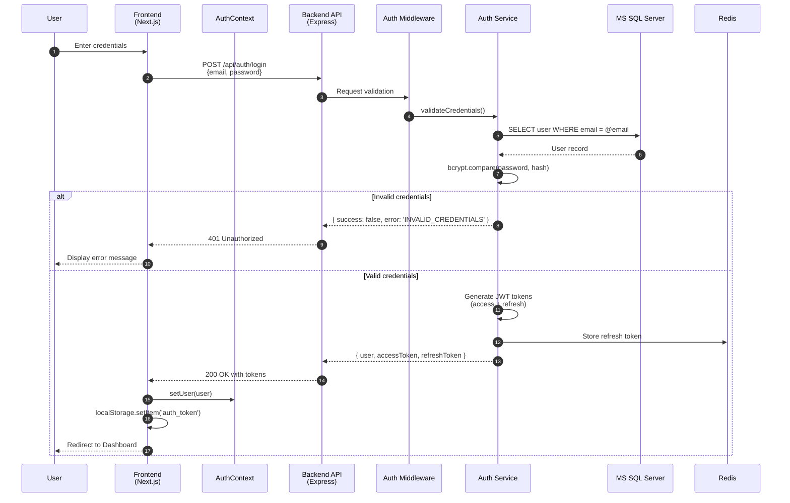

### 13.2 Token Refresh Flow

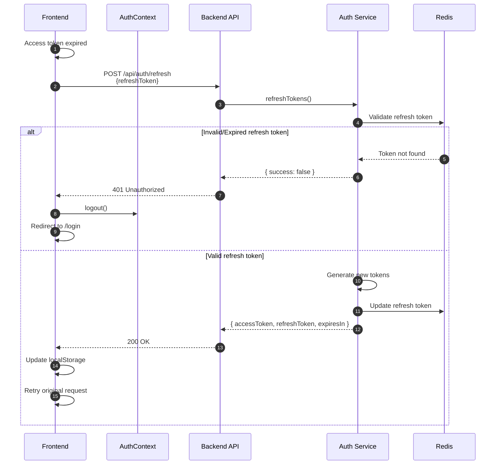

### 13.3 Progress Notes - Create Note Flow

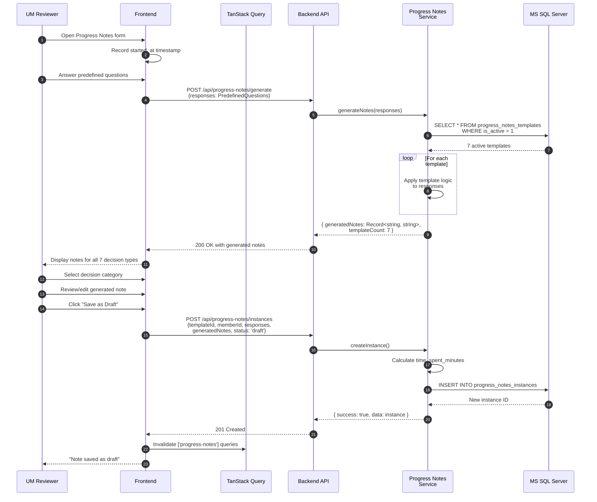

### 13.4 Progress Notes - Submit & Analytics Flow

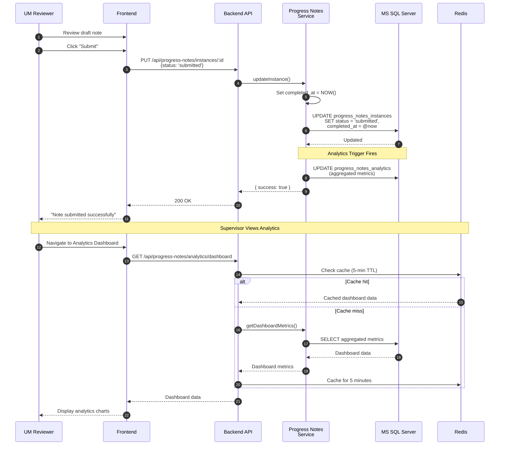

### 13.5 Progress Notes - Reassignment Flow

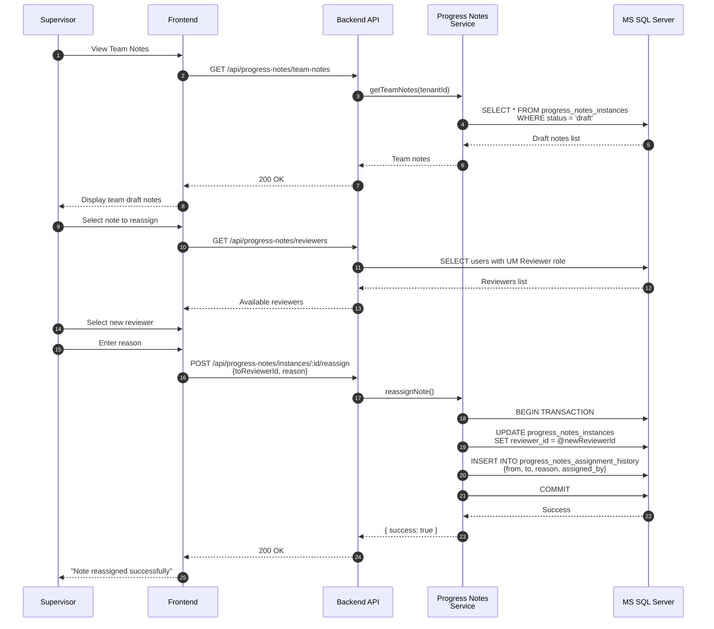

### 13.6 UM Consolidator - Case Assignment Flow

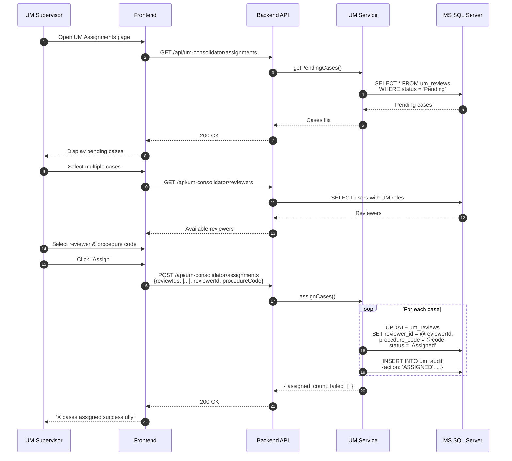

### 13.7 UM Consolidator - Review Workflow

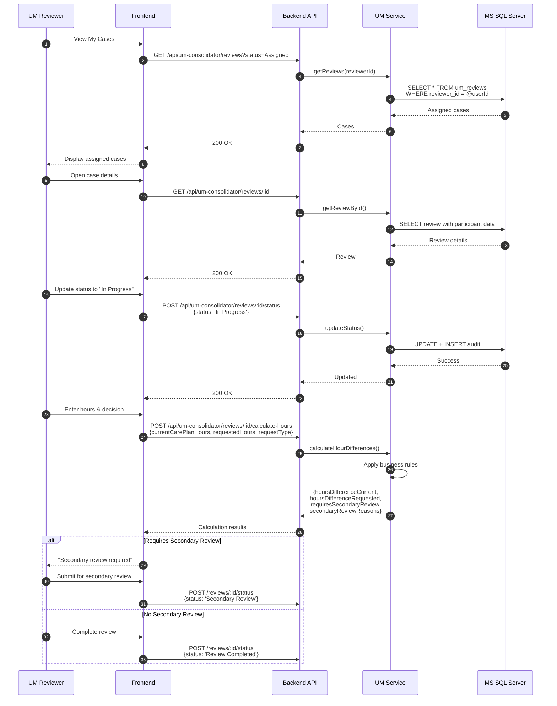

### 13.8 UM Consolidator - Secondary Review Flow

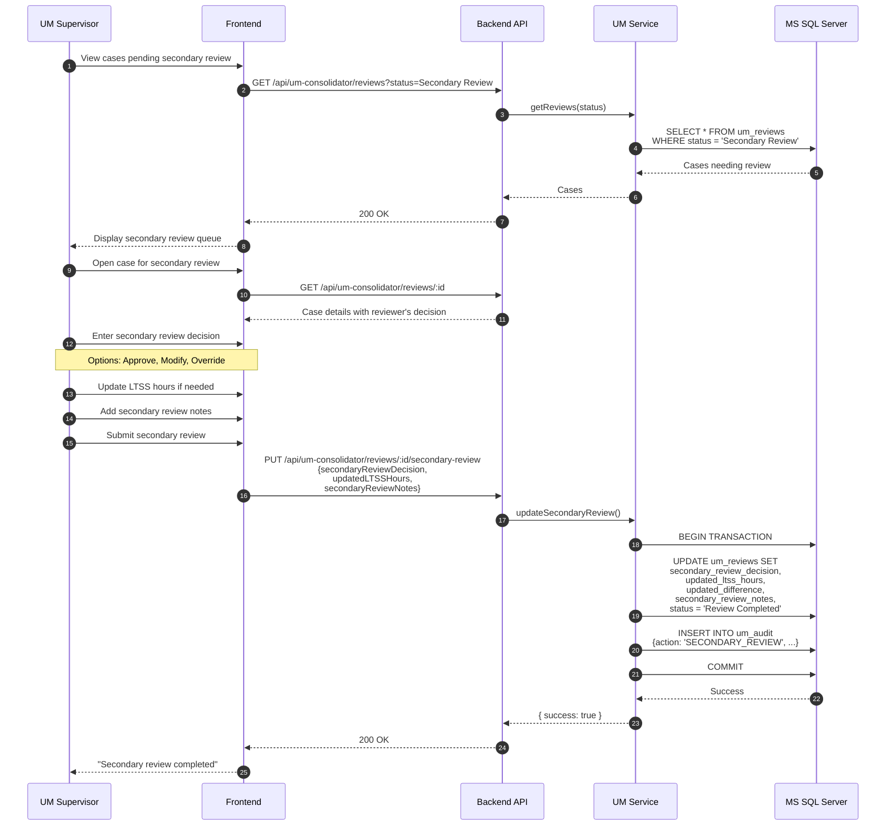

### 13.9 Members - Search & View Flow

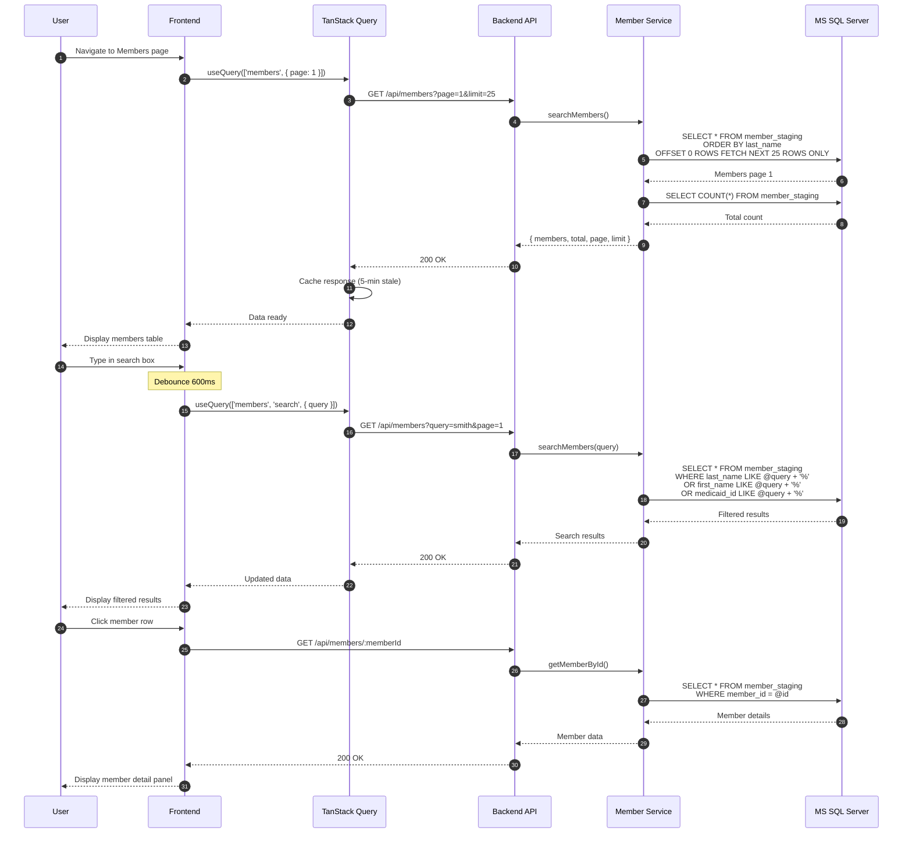

### 13.10 Providers - Search & Lookup Flow

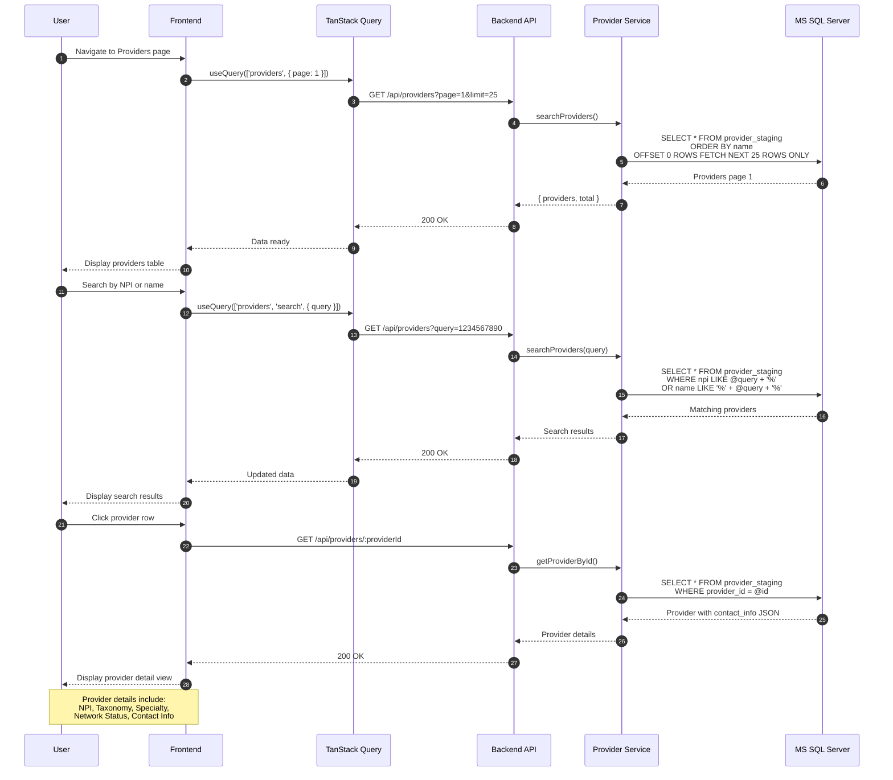

### 13.11 User Settings - Profile & Password Flow

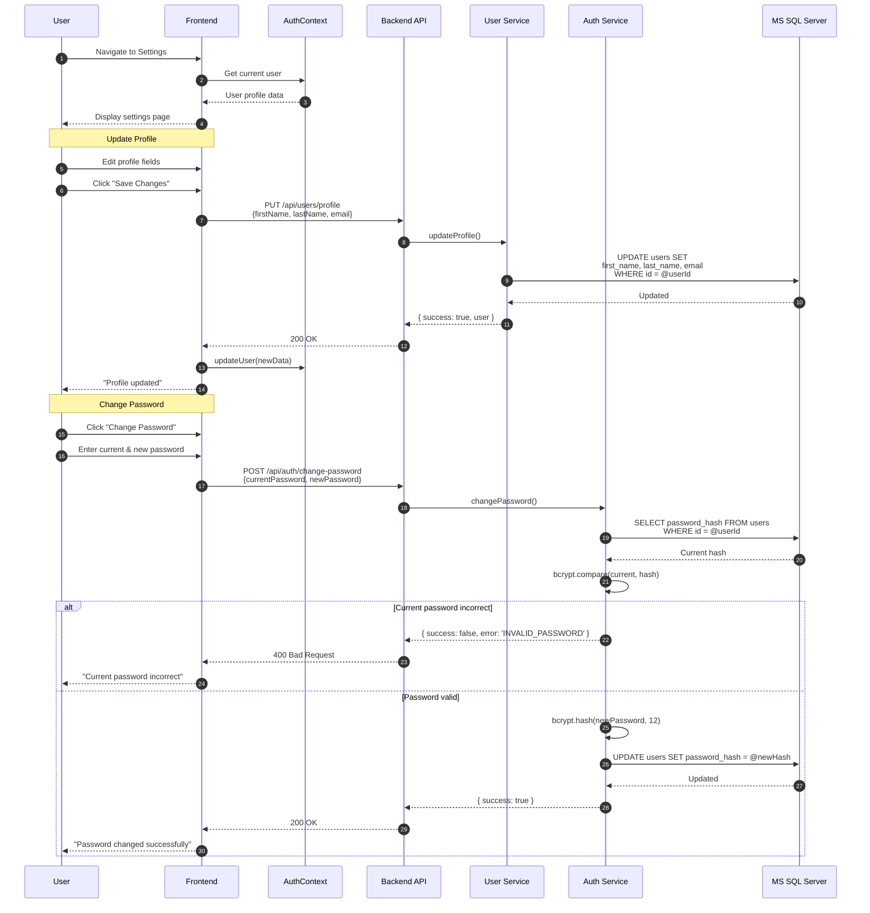

### 13.12 User Settings - Role & Permissions View

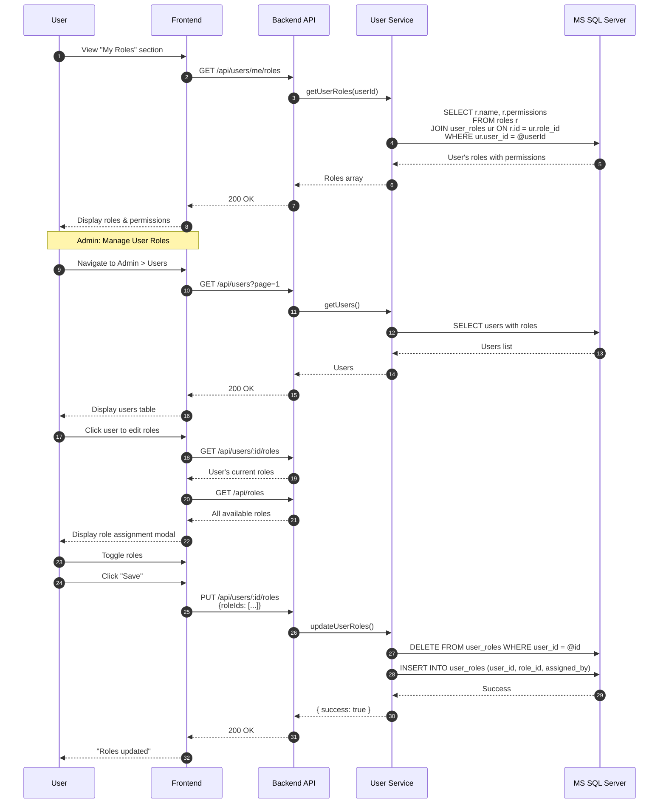

---

## Appendix A: Key File References

### Backend Core Files
- `backend/src/index.ts` - Express app setup
- `backend/src/config/environment.ts` - Environment configuration
- `backend/src/services/universal-database.service.ts` - Database abstraction
- `backend/src/services/auth.service.ts` - Authentication logic
- `backend/src/middleware/auth.middleware.ts` - JWT validation

### Frontend Core Files
- `frontend/src/app/layout.tsx` - Root layout with providers
- `frontend/src/lib/api.ts` - API client configuration
- `frontend/src/contexts/auth-context.tsx` - Authentication context
- `frontend/src/providers/query-provider.tsx` - TanStack Query setup

### Deployment Files
- `deployment/deploy-master.ps1` - Master orchestrator
- `deployment/infrastructure/docker-compose.yml` - Infrastructure setup
- `deployment/applications/{env}/docker-compose.yml` - Environment apps

---

**Document Version:** 1.0.0  
**Last Updated:** February 2026  
**Author:** CHC Insight Development Team
