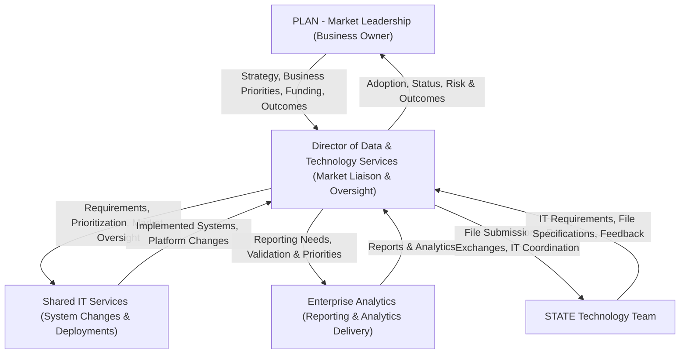

# Director of Data & Technology Services (DTTS)
## Operational Framework Document

---

## 1. Operating Model (Market View)

### Purpose
This operating model defines how the **Director of Data & Technology Services (DDTS)** functions within the PLAN (market), in coordination with **Shared IT Services** and **Enterprise Analytics (EA)**.

The DDTS role exists to ensure **market priorities are translated into executable initiatives**, and that delivery through shared services meets business, regulatory, and operational expectations.

---

### Operating Model Diagram

---

## Organizational Context

| Aspect | Detail |
|--------|--------|
| **Reports To** | PLAN Leadership (manages entire business) |
| **Key Partners** | IS Shared Service, Enterprise Analytics (EA) Team, STATE IT |
| **Role Focus** | Liaison with IS Shared Service & oversee implementations for market; Manage STATE IT file exchanges |
| **System Changes** | Managed by IS Shared Service |
| **Report Delivery** | Managed by Enterprise Analytics Team |
| **State File Exchanges** | Coordinated by DDTS with STATE IT |

---

## 1. Accountability Areas & Responsibilities Matrix

| Accountability Area | Responsibility | Details | Frequency | Complexity |
|---------------------|----------------|---------|-----------|------------|
| **1.1 Strategic Direction & Leadership** | Needs analysis for state/regional health plan | Assess technology and data requirements to support health plan operations | Quarterly | High |
| | Coordination with corporate IT departments | Align local initiatives with corporate IT strategy and standards | Monthly | Medium |
| | Implementation oversight | Monitor and guide technology implementations ensuring alignment with plan goals | Ongoing | High |
| | Plan adoption and utilization | Drive adoption of new systems and ensure optimal utilization | Ongoing | Medium |
| **1.2 Data Structures & Algorithms** | Study existing data structures | Analyze current data architecture for improvement opportunities | Quarterly | High |
| | Create new structures/algorithms | Design solutions to improve health plan information management | As needed | High |
| | Implementation of structures | Oversee deployment of new data structures | Project-based | High |
| | Communication improvement | Enhance data flow and understanding across departments | Ongoing | Medium |
| **1.3 Customer Interface & Resource Mgmt** | Interface with internal customers | Address data-related issues with internal stakeholders | Daily | Medium |
| | Interface with external customers | Manage external data requests and issues | Weekly | Medium |
| | Identify data/technical needs | Assess and document technical requirements | Ongoing | High |
| | Define solutions | Develop technical solutions for identified needs | As needed | High |
| | Manage departmental resources | Allocate staff and budget effectively | Monthly | Medium |
| | Prioritize project requirements | Rank and sequence multiple project deliverables | Weekly | High |
| **1.4 Local IT Planning & Operations** | IT planning | Develop local IT roadmap aligned with corporate initiatives | Annually/Quarterly | High |
| | IT implementation | Coordinate with IS Shared Service for system deployments | Project-based | High |
| | IT operations oversight | Ensure smooth daily IT operations for market | Daily | Medium |
| | Corporate IT alignment | Ensure local IT supports company-wide goals | Ongoing | Medium |
| **1.5 Project Management & Compliance** | Direct local project management | Lead project teams for timely execution | Ongoing | High |
| | Plan/organizational initiatives | Implement strategic initiatives from PLAN leadership | As assigned | High |
| | Encounter metrics compliance | Oversee plan compliance around encounter metrics | Monthly | High |
| | Project timeline management | Ensure projects meet deadlines | Weekly | Medium |
| **1.6 Human Resource Management** | Recruiting & selecting | Hire qualified IT operations staff | As needed | Medium |
| | Orienting & training | Onboard and develop team members | Ongoing | Medium |
| | Assigning & scheduling | Allocate work and manage schedules | Weekly | Low |
| | Coaching & counseling | Provide guidance and support to staff | Ongoing | Medium |
| | Disciplining employees | Address performance issues | As needed | High |
| | Communicating job expectations | Set clear performance standards | Quarterly | Medium |
| | Performance monitoring & appraisal | Evaluate and review job contributions | Annually/Quarterly | Medium |
| | Compensation planning | Review and recommend compensation actions | Annually | Medium |
| | Policy enforcement | Ensure adherence to policies and procedures | Ongoing | Medium |
| **1.7 Core Systems & Platform Mgmt** | FACETS membership changes | Oversee changes to membership processing applications | As needed | High |
| | FACETS claims processing changes | Oversee changes to claims processing applications | As needed | High |
| | Associated technologies & products | Manage related technology products | Ongoing | High |
| | Platform integration | Coordinate integration of platforms | Project-based | High |
| | Interface documentation | Document internal/external interfaces | As needed | Medium |
| **1.8 Knowledge Building & Stakeholder Engagement** | Build knowledge & competency | Develop organizational capabilities | Ongoing | Medium |
| | Support company growth | Contribute to strategic growth initiatives | Ongoing | Medium |
| | Meet with managers | Discuss system requirements, specs, costs, timelines | Weekly/Bi-weekly | Medium |
| | Requirements gathering | Document system requirements from stakeholders | As needed | High |
| **1.9 STATE IT & File Exchange Management** | State file submissions | Coordinate and oversee regulatory file submissions to state agencies | Per schedule | High |
| | File exchange specifications | Manage file format requirements and specifications from STATE IT | As needed | High |
| | State compliance coordination | Ensure data exchanges meet state regulatory requirements | Ongoing | High |
| | State interface troubleshooting | Resolve file exchange issues and rejections with STATE IT | As needed | High |
| | State reporting deadlines | Monitor and ensure timely submission of required state files | Per schedule | High |

---

## 2. RACI Matrix

**Legend:**
- **R** = Responsible (does the work)
- **A** = Accountable (ultimately answerable)
- **C** = Consulted (provides input)
- **I** = Informed (kept updated)

| Activity | DTTS Director | IS Shared Service | Enterprise Analytics | PLAN Leadership | Department Managers | STATE IT |
|----------|---------------|-------------------|---------------------|-----------------|---------------------|----------|
| **Strategic Planning** |
| Health plan needs analysis | A/R | C | C | I | C | I |
| IT strategy alignment | A/R | C | I | I | I | I |
| Technology roadmap development | A/R | C | C | A | C | I |
| **Data Management** |
| Data structure design | A/R | C | C | I | I | I |
| Algorithm development | A/R | C | C | I | I | I |
| Data quality oversight | A | R | C | I | C | I |
| **System Implementation** |
| System change requests | A | R | I | I | C | I |
| Implementation oversight | A/R | R | I | I | C | I |
| Platform integration | A/R | R | C | I | C | I |
| FACETS changes coordination | A | R | I | I | C | I |
| Interface documentation | A/R | C | I | I | I | C |
| **State File Exchanges** |
| State file submissions | A/R | C | C | I | I | R |
| File specification management | A/R | C | I | I | I | C |
| State compliance coordination | A/R | C | C | I | I | C |
| File exchange troubleshooting | A/R | C | I | I | I | R |
| **Project Management** |
| Local project management | A/R | C | C | I | C | I |
| Timeline management | A/R | C | C | I | C | I |
| Resource allocation | A/R | I | I | I | C | I |
| Encounter metrics compliance | A/R | C | R | I | C | C |
| **Reporting & Analytics** |
| Report requirements definition | A/R | I | C | I | C | I |
| Report delivery | I | I | A/R | I | I | I |
| Data analysis requests | A | I | R | I | C | I |
| State reporting requirements | A/R | I | C | I | I | C |
| **Human Resources** |
| Staff recruiting | A/R | I | I | I | I | I |
| Training & development | A/R | C | I | I | I | I |
| Performance management | A/R | I | I | I | I | I |
| Policy enforcement | A/R | I | I | I | I | I |
| **Stakeholder Management** |
| Internal customer interface | A/R | C | C | I | C | I |
| External customer interface | A/R | C | C | I | I | I |
| State agency interface | A/R | I | I | I | I | R |
| Manager consultations | A/R | C | C | I | R | I |
| Knowledge building | A/R | C | C | I | C | I |

---

## 3. Key Performance Indicators (KPIs)

### 3.1 Strategic & Operational KPIs

| KPI Category | KPI | Target | Measurement Frequency |
|--------------|-----|--------|----------------------|
| **Strategic Alignment** |
| IT initiatives aligned with corporate goals | ≥ 95% | Quarterly |
| Health plan technology needs addressed | 100% critical needs | Quarterly |
| Strategic project completion rate | ≥ 90% | Annually |
| **Implementation Success** |
| System implementation on-time delivery | ≥ 85% | Per project |
| Implementation within budget | ≤ 10% variance | Per project |
| Post-implementation defect rate | < 5% | Per project |
| User adoption rate for new systems | ≥ 80% within 90 days | Per implementation |

### 3.2 Data & Technology KPIs

| KPI Category | KPI | Target | Measurement Frequency |
|--------------|-----|--------|----------------------|
| **Data Quality** |
| Data structure improvement initiatives | ≥ 2 per year | Annually |
| Data accuracy rate | ≥ 98% | Monthly |
| Data-related issue resolution time | < 48 hours (critical) | Monthly |
| **System Performance** |
| FACETS system availability | ≥ 99.5% | Monthly |
| Platform integration success rate | ≥ 95% | Per integration |
| Interface documentation completeness | 100% | Quarterly |

### 3.3 Project Management KPIs

| KPI Category | KPI | Target | Measurement Frequency |
|--------------|-----|--------|----------------------|
| **Project Delivery** |
| Projects delivered on schedule | ≥ 85% | Quarterly |
| Projects within scope | ≥ 90% | Quarterly |
| Stakeholder satisfaction score | ≥ 4.0/5.0 | Per project |
| **Compliance** |
| Encounter metrics compliance rate | 100% | Monthly |
| Regulatory compliance adherence | 100% | Quarterly |
| Audit findings resolved on time | 100% | Per audit |

### 3.4 Customer & Stakeholder KPIs

| KPI Category | KPI | Target | Measurement Frequency |
|--------------|-----|--------|----------------------|
| **Customer Service** |
| Internal customer satisfaction | ≥ 85% | Quarterly |
| External customer issue resolution | < 5 business days | Monthly |
| Response time to data requests | < 24 hours (initial) | Monthly |
| **Stakeholder Engagement** |
| Manager meeting attendance | 100% scheduled | Monthly |
| Requirements documentation accuracy | ≥ 95% | Per project |
| Cross-functional collaboration score | ≥ 4.0/5.0 | Quarterly |

### 3.5 Human Resources KPIs

| KPI Category | KPI | Target | Measurement Frequency |
|--------------|-----|--------|----------------------|
| **Team Management** |
| Employee retention rate | ≥ 85% | Annually |
| Training completion rate | 100% required training | Quarterly |
| Performance review completion | 100% on schedule | Annually |
| Employee engagement score | ≥ 75% | Annually |
| **Development** |
| Succession planning coverage | 100% key positions | Annually |
| Skills gap closure | ≥ 80% identified gaps | Annually |
| Knowledge transfer sessions | ≥ 4 per year | Quarterly |

### 3.6 State File Exchange KPIs

| KPI Category | KPI | Target | Measurement Frequency |
|--------------|-----|--------|----------------------|
| **File Submission** |
| State file submission on-time rate | 100% | Per submission cycle |
| File acceptance rate (first submission) | ≥ 95% | Monthly |
| File rejection resolution time | < 48 hours | Per rejection |
| **Compliance** |
| State regulatory compliance | 100% | Quarterly |
| File specification adherence | 100% | Per submission |
| State audit findings resolved | 100% on time | Per audit |

---

## 4. Operational Cadence

### Daily Activities
- Monitor IT operations status
- Address critical data/system issues
- Interface with internal customers on urgent matters

### Weekly Activities
- Project status reviews
- Resource allocation adjustments
- Priority assessment for deliverables
- Staff scheduling and assignments
- Manager consultations on system requirements

### Monthly Activities
- Coordination meetings with IS Shared Service
- Encounter metrics compliance review
- Departmental resource management review
- Performance monitoring

### Quarterly Activities
- Strategic alignment review with PLAN leadership
- Health plan needs analysis
- Data structure improvement assessment
- Employee performance discussions
- Stakeholder satisfaction surveys

### Annually Activities
- IT roadmap development
- Compensation planning and reviews
- Formal performance appraisals
- Training needs assessment
- Succession planning review

---

## 5. Key Relationships & Interfaces

| Stakeholder | Interaction Type | Purpose | Frequency |
|-------------|------------------|---------|-----------|
| **PLAN Leadership** | Strategic alignment | Report on IT initiatives, receive direction | Monthly |
| **IS Shared Service** | Operational coordination | System changes, implementations, support | Weekly |
| **Enterprise Analytics** | Collaboration | Report requirements, data needs | Weekly |
| **STATE IT** | Regulatory coordination | File exchanges, compliance, specifications | Weekly/Per schedule |
| **Department Managers** | Consultation | Requirements gathering, system discussions | Bi-weekly |
| **Internal Customers** | Service delivery | Data issues, technical support | Daily |
| **External Customers** | Issue resolution | Data requests, interface matters | As needed |
| **Direct Reports** | Management | Coaching, assignments, development | Daily |

---

## 6. Decision Authority Matrix

| Decision Type | DTTS Director Authority | Escalation Required To |
|---------------|------------------------|------------------------|
| Local IT operational decisions | Full authority | - |
| Resource allocation within budget | Full authority | - |
| Staff hiring (within headcount) | Full authority | - |
| Project prioritization (local) | Full authority | - |
| State file exchange coordination | Full authority | - |
| State file specification changes | Coordinate/Implement | STATE IT |
| System change requests | Recommend/Coordinate | IS Shared Service |
| Budget increases > 10% | Recommend | PLAN Leadership |
| New technology adoption | Recommend | PLAN Leadership + IS Shared Service |
| Policy changes | Recommend | PLAN Leadership |
| Enterprise report changes | Coordinate | Enterprise Analytics |
| State compliance issues | Escalate/Coordinate | PLAN Leadership + STATE IT |

---

*Document Version: 1.0*
*Created: February 2026*
*Role: Director of Data & Technology Services*
